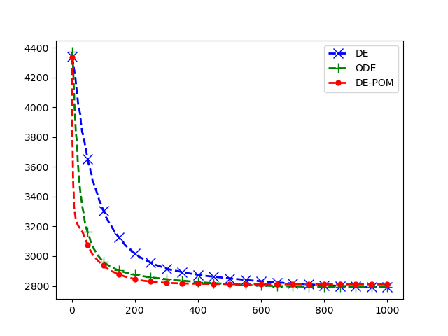

# Partial Opposition-Based Learning Using Mean of Best Candidates

The repository holds the implementation of DE-POM algorithm compared with ODE and DE.

## Experimental Results

Mean results of the proposed algorithm (DE-POM), ODE, and DE averaged
over 50 runs. The algorithms where evaluation on benchmark functions from
CEC-2014.

|Variable|Description|Value|
|-----|--------------|----|
|Cr|Crossover rate|0.7|
|F|Mutation factor|0.5|
|Np|Population size|100|
|Con|Confidence interval|95%|
|Jr|Jumping rate|0.3|
|R|Initial search range|[-100, 100]|
|D|Number of dimensions|100|
|N|Number of runs|50|
|G|Number of generations|1000 X D / Np|
|Rf|Reference factor|0.1|

|Function|DE|ODE|DE-POM|
|---|------|------|------|
|1|9.677e+08‡|1.288e+08‡|2.832e+07|
|2|1.926e+07‡|1.031e+05≈|9.228e+04|
|3|5.058e+04‡|4.132e+04‡|2.087e+04|
|4|5.675e+02†|6.255e+02†|7.001e+02|
|5|5.214e+02‡|5.214e+02‡|5.211e+02|
|6|7.638e+02‡|7.483e+02‡|6.668e+02|
|7|7.012e+02‡|7.002e+02≈|7.001e+02|
|8|1.702e+03‡|1.542e+03‡|1.079e+03|
|9|1.844e+03‡|1.678e+03‡|1.203e+03|
|10|3.258e+04‡|2.894e+04‡|1.151e+04|
|11|3.358e+04‡|3.309e+04‡|2.495e+04|
|12|1.204e+03‡|1.204e+03‡|1.202e+03|
|13|1.301e+03‡|1.301e+03‡|1.301e+03|
|14|1.401e+03‡|1.400e+03‡|1.400e+03|
|15|1.591e+03‡|1.591e+03‡|1.558e+03|
|16|1.648e+03‡|1.648e+03‡|1.646e+03|
|17|8.795e+07‡|8.129e+07‡|2.729e+06|
|18|9.219e+03‡|5.640e+03‡|3.939e+03|
|19|1.979e+03‡|1.955e+03†|1.966e+03|
|20|1.028e+05‡|8.323e+04‡|2.770e+04|
|21|1.700e+07‡|1.619e+07‡|1.424e+06|
|22|7.864e+03‡|7.002e+03‡|6.098e+03|
|23|2.648e+03‡|2.646e+03‡|2.645e+03|
|24|2.791e+03†|2.790e+03†|2.807e+03|
|25|2.878e+03‡|2.738e+03†|2.770e+03|
|26|2.701e+03†|2.713e+03≈|2.718e+03|
|27|7.155e+03‡|7.002e+03‡|5.701e+03|
|28|3.651e+03‡|3.456e+03≈|3.477e+03|
|29|3.185e+03≈|3.190e+03‡|3.174e+03|
|30|9.505e+03‡|8.874e+03‡|7.113e+03|
|w/t/l|26/1/3|22/4/4|-|

### Convergence Plots

Convergence plots for f5, f8, f12, f17, f24, and f28 for DE-POM, ODE, and DE.
The results are averaged over 50 runs.

#### f5

#### f8

#### f12

#### f17

#### f24

#### f28

